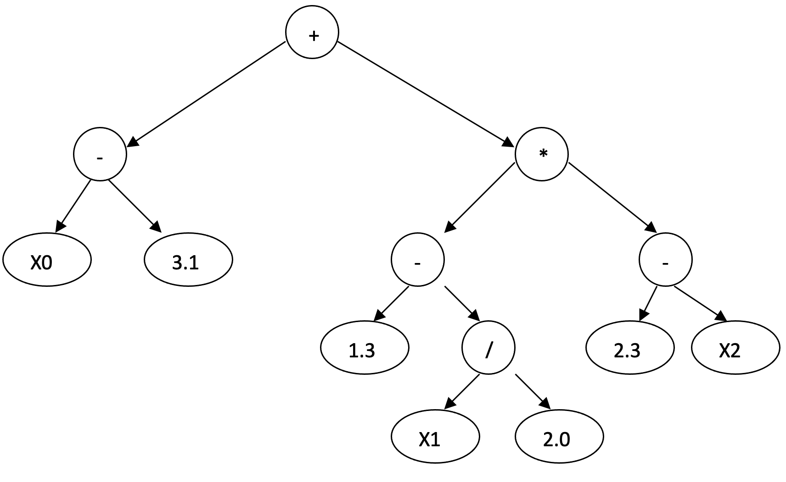

# CSC 240 Computer Science III
### Homework 5, Inheritance Part 2

-	The oldest known book on arithmetic is the Ahmes Papyrus, written by an Egyptian scribe 35 centuries ago.  Fractions were apparently known at that time as well. A more ambitious problem involves unknown quantities, or variables.  This idea is hinted in the old problem: “Hau, its whole, its seventh, it makes nineteen.” Hmmm, sounds like the equation `x + x/7 = 19`.   By the Middle Ages (maybe 1200 A.D.?) the Arabic mathematician al-Khowarizmi had written books on the Hindu-Arabic number system, and on al jabr w’ al muquabalah, "the reunion and the opposition". From this apparently comes the English word algebra.

For this homework problem, turn the Arithmetic project from the last homework into the Algebra project, by including a new class named `Variable`. Objects of this class represent a variable, like `X0` or `X4`, whose value is determined sometime after it is defined. ***(Use Interfaces, Inheritance, and Composition)***

In the Arithmetic project, we created expressions like `((3 + 4) / (2 + 9))`.  We even were able to evaluate expressions like this.  Now we want to create (in the Algebra project) expressions like `((X0 – 3.14) + (((1.3 – (X1 / 2.0)) * (2.3 – X2)))`, where the expression knows how to evaluate itself if given an array of values for `X0`, `X1` and `X2`.  Of course, the tree representation of the above algebraic expression isn't really different.  It just has a new node type, the Variable node, and can be slightly more complex than the expressions you created before:

But how can we evaluate a tree like this?  The Xs must be given concrete values.  So, the `eval()` method for every `Node` must be given an array of values (`double[]` data) so that when this array is passed down to a `Variable`, it can select its value.  Thus a `Variable` node whose index is 2 should return `data[2]`.  So every method `eval()` must now be `eval(double[] data)`.

Here is the scheme.  An object of the `Variable` class holds an integer (its "index" or "subscript") whose value says if it is an `X0` or `X1` or `X2` or ...  When a Variable object is asked to evaluate itself, it uses its index variable to look in the data array to find its value, and returns this value.  All the other Node subclasses work just as they did before. When you write the code for this problem, make Node an abstract class, as we did in class. 

This is the starting form of your files: 

```mermaid
classDiagram
      Node <|-- Binop
      Node <|-- Const
      Binop <|-- Plus
      Binop <|-- Minus
      Binop <|-- Divide
      Binop <|-- Mult
      Node: +eval()* double
      class Const{
         -value : double
         +eval() double
         +toString() String
      }
      class Binop {
          -lChild : Node
          -rChild : Node
          +Binop(Node lChild, Node rChild)
      }
      class Plus{
          +eval() double
          +toString() String
      }
      class Minus{
          +eval() double
          +toString() String
      }
      class Mult{
          +eval() double
          +toString() String
      }
      class Divide{
          +eval() double
          +toString() String
      }
```

This is the ending form of your files: 

```mermaid
classDiagram
      Node <|-- Binop
      Node <|-- Const
      Node <|-- Variable
      Binop <|-- Plus
      Binop <|-- Minus
      Binop <|-- Divide
      Binop <|-- Mult
      Node: +eval(double[] values)* double
      class Const{
         -value : double
         +eval(double[] values) double
         +toString() String
      }
      class Variable{
         -index : int
         +eval(double[] values) double
         +toString() String
      }
      class Binop {
          -lChild : Node
          -rChild : Node
          +Binop(Node lChild, Node rChild)
      }
      class Plus{
          +eval(double[] values) double
          +toString() String
      }
      class Minus{
          +eval(double[] values) double
          +toString() String
      }
      class Mult{
          +eval(double[] values) double
          +toString() String
      }
      class Divide{
          +eval(double[] values) double
          +toString() String
      }
```

For this part of the assignment, create algebraic trees of a fixed size, just as you did for the Arithmetic project previously. Each tree should be a balanced binary tree, containing three operators and four terminals. For the terminals, first flip a fair coin. If it comes up heads, choose a random constant in the range `[1, 20]`. If it comes up tails, choose a variable, randomly in the range `{X0, X1, X2}`. Have your `main()` method evaluate your tree twice, by using the values `{X0, X1, X2} = {1, 2, 3}` and `{X0, X1, X2} = {4, 5, 6}`.

Submit .java files for your work, including a test file called `TestAlgebra.java` containing a main method that demonstrates that you can generate random algebraic trees that can evaluate themselves. These files should submitted to this repository. Make sure that TestAlgebra.java is in the root directory and that the other files used by `TestAlgebra.java` are in the correct directory so that `javac TestAlgebra.java` will compile all of the other submitted files as well. If your `Algebra` classes are in the default package, then they should be in the root directory as well, and if they are not in the default package, then you will need to modify [TestAlgebraFixed.java](TestAlgebraFixed.java) to import the appropriate classes.

